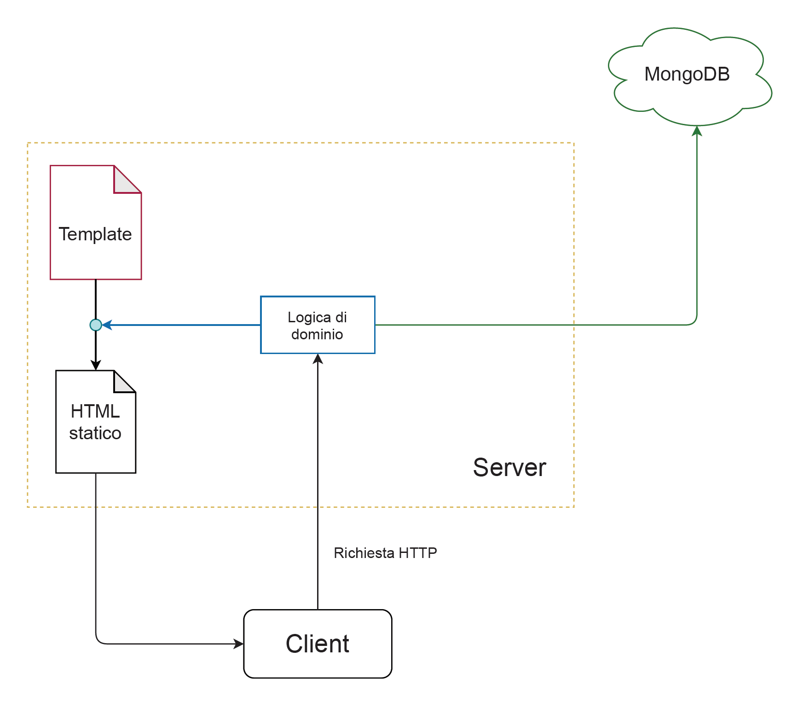

# Stoccaggio

## Introduzione

Il progetto consiste in un'**applicazione web** che porta con se l'obiettivo di facilitare la gestione di uno o più magazzini. Il progetto è ancora in fase di sviluppo ed è disponibile su [**GitHub**](https://github.com/signoridellostoccaggio/gestorestoccaggio-web)

## Generalità

L'app consentirebbe all'utente di avere una panoramica intuitiva del magazzino, che ottimizzerebbe gli spazi, per mezzo della quale sarebbe possibile:

* Caricare colli specificando le dovute caratteristiche
* Apportare eventuali modifiche ai colli
* Elminare colli
* Visualizzare la posizione dei colli

Le stesse operazioni di **CRUD** sono disponibili per i magazzini stessi

## Architettura

**Gestore Stoccaggio** è un'architettura web completamente basata sull'elaborazione **lato server**.

In effetti, il server si occupa di:

1. Prelevare le informazioni da una [base dati](./#base-dati)
2. [Costruire](./#template-engine) una pagina HTML con le informazioni prelevate



## Server

L'applicazione che fa funzionare il server è scritta in **TypeScript** e utilizza un framework di **Node.js**: [**NestJS**](https://nestjs.com), utilizzato per creare applicazioni web scalabili e leggibili attraverso una sorta di pattern per l'organizzazione di file e cartelle.

Inoltre, NestJS funziona per mezzo dei _decorators_, funzioni speciali che parametrizzano e gestiscono il codice sottostante:

```typescript
@Get()
@Render('warehouses')
async mainPage() {
  return {
    warehouses: await this.warehousesService.findAll()
  };
}
```

> NestJS a basso livello utilizza [Express](https://expressjs.com/it/)

## Template Engine

L'applicazione restituisce al browser, al momento della risposta HTTP, una pagina HTML che non necessita di essere elaborata. Questo perché il server si occupa di costruire la pagina, inserendo tutti i dati necessari e relativi alle richieste dell'utente. Il motore di template [**EJS**](https://ejs.co) ci permette di aggiungere del **JavaScript** all'HTML.

```html
<% warehouses.forEach((wh, i) => { %>
    <tr class="<%= i % 2 ? "bg-gray-50" : "bg-white-50"; %>">
        <td class="px-6 py-4 whitespace-nowrap text-sm font-medium text-gray-900">
            <%= wh.name; %>
        </td>
        <td class="px-6 py-4 whitespace-nowrap text-sm text-gray-500">
            <%= wh.address; %>
        </td>
        <td class="px-6 py-4 whitespace-nowrap text-right text-sm font-medium">
            <a href="/magazzini/<%= wh._id %>"
               class="text-indigo-600 hover:text-indigo-900">Modifica</a>
        </td>
    </tr>
<% }); %>
```

## Base Dati

L'app si interfaccia con un database **documentale**: ****[**MongoDB**](https://www.mongodb.com/it); attraverso una libreria JavaScript chiamata [Mongoose](https://mongoosejs.com), che offre le API necessarie per effettuare query e modifiche.

Essendo un database documentale, MongoDB non impone l'utilizzo di tabelle con righe e campi, bensì, vengono utilizzate delle strutture chiamate _collections,_ che contengono le relative istanze, chiamate _documents_. Ogni collezione ha un suo _modello,_ con Mongoose il modello si definisce attraverso uno _schema_ direttamente nel codice dell'app_._

```typescript
import { Prop, Schema, SchemaFactory } from '@nestjs/mongoose';
import { Document }                    from 'mongoose';
import { UserEntity }                  from '../entities/user.entity';

export type UserDocument = User & Document;

@Schema()
export class User implements UserEntity {
  @Prop({ required: true, unique: true })
  email: string;

  @Prop({ required: true })
  password: string;
}

export const UserSchema = SchemaFactory.createForClass(User);
```

Ecco alcuni metodi che wrappano le API di Mongoose

```typescript
create(createWarehouseDto: CreateWarehouseDto) {
  const createdWarehouse = new this.warehouseModel(createWarehouseDto);
  return createdWarehouse.save();
}

findAll() {
  return this.warehouseModel.find().exec();
}

findById(id: string) {
  return this.warehouseModel.findById(id).exec();
}

update(id: string, updateWarehouseDto: UpdateWarehouseDto) {
  return this.warehouseModel.findOneAndUpdate(
    { _id: id },
    updateWarehouseDto,
    { ...config.db.mongo.defaultUpdateOptions }
  ).exec();
}

remove(id: string) {
  return this.warehouseModel.findByIdAndDelete(id).exec();
}
```

> L'applicazione sfrutta il servizio [**MongoDB Atlas**](https://cloud.mongodb.com/v2/603762ad720712003d1e4e8f#clusters), che ci permettte di utilizzare il database da una macchina virtuale remota

## Interfaccia Grafica

L'applicazione utilizza [**Tailwind-css**](https://tailwindcss.com), un framework che offre classi css "preconfezionate" da applicare direttamente sull'HTML. Tailwind offre una **flessibilità** maggiore di [bootstrap-css](https://getbootstrap.com/docs/5.0/getting-started/introduction/) e il foglio di stile è il risultato di una compilazione.

