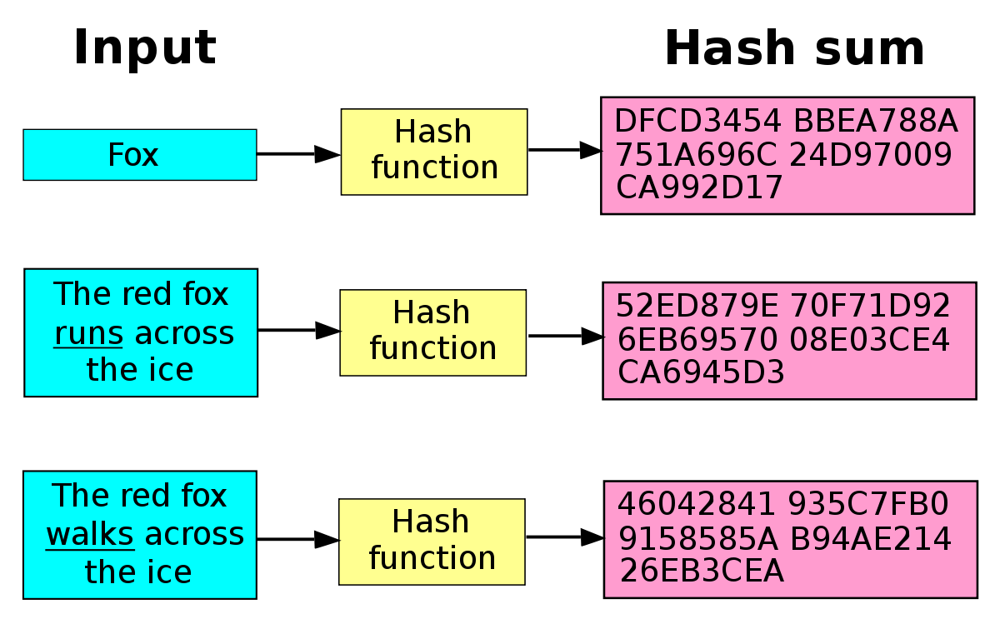

# Funzioni di Hash

## Introduzione

Il termine [**Hash**](https://it.wikipedia.org/wiki/Funzione_di_hash) ****deriva dal verbo inglese _"to hash",_ che significa sminuzzare, casualizzare, disordinare...

## Cosa sono

Le funzioni di Hash servono per trasformare una stringa **qualsiasi** in una stringa composta da caratteri alfanumerici di dimensione **fissa**

Le funzioni di hash sono funzioni _non invertibili,_ ossia funzioni **non** biunivoche \(partendo dal codice generato non è possibile tornare alla stringa originale\)

## Dettagli

> Dato un messaggio **M**; Data una funzione di Hash **h\(\)**;

`d = h(M)`


**d** rappresenta il **Digest**, ossia il risultato di una funzione di Hash


## Proprietà

* Resistenza alla preimmagine

  > è impossibile trovare la stringa che ha generato un _dato hash_

* Resistenza alla seconda preimmagine

  > è impossibile modificare una stringa e ricevere lo stesso hash di una precedente _data stringa_

* Resistenza alle collisioni

  > è impossibile trovare una coppia di stringhe che diano lo stesso risultato hash

In un certo senso possiamo affermare che ogni stringa possa essere identificata univocamente da un'impronta digitale, _il proprio **Digest**_

## Utilizzi

### Protezione dagli errori

L'uso delle funzioni hash per trovare errori nelle trasmissioni è molto comune. La funzione hash viene _calcolata dal mittente_ a partire dai dati e il suo valore è inviato insieme ai dati. _Il ricevente calcola di nuovo_ la funzione hash, e se i valori hash non corrispondono, significa che è avvenuto un errore durante la trasmissione. Questo metodo consente un controllo dell'integrità dei dati migliore della più tradizionale [checksum](https://it.wikipedia.org/wiki/Checksum)

### Memorizzazione password

Di solito un sistema informatico memorizza le password non in chiaro. Per motivi di sicurezza la _memorizzazione della_ [_password_](https://it.wikipedia.org/wiki/Password) __viene effettuata sfruttando la funzione di hash.

### Integrità

La funzione di hash viene utilizzata per garantire che un messaggio non sia stato modificato


> Sfrutta le proprietà della funzione di hash


### Firme digitali

Le funzioni di hash permettono una rapida creazione della [firma digitale](https://it.wikipedia.org/wiki/Firma_digitale), vengono utilizzate per evitare l’utilizzo di complessi algoritmi di autenticazione su moli di dati molto grandi

## Algoritmi

### MD5

E' una funzione di hash crittografica; questa funzione prende in input una stringa di lunghezza arbitraria e ne produce in output un'altra a _128 bit_

Molti _controlli di integrità_ e _creazioni di firme digitali_, al giorno d'oggi, vengono effettuati proprio da [MD5](https://it.wikipedia.org/wiki/MD5)

### SHA

Con il termine [SHA](https://it.wikipedia.org/wiki/Secure_Hash_Algorithm) \(Secure Hash Algorithm\) si indica una famiglia di _cinque diverse funzioni_ crittografiche di hash sviluppate a partire dal 1993. _SHA non è ancora stato attaccato_

> * SHA-1
> * SHA-224
> * SHA-256
> * SHA-384
> * SHA-512

SHA-1 produce un digest del messaggio di soli 160 bit, mentre gli altri producono digest di lunghezza in bit pari al numero indicato nella loro sigla


> SHA-256 produce un digest di 256 bit


### Differenze

| MD5 | SHA |
| :--- | :--- |
| Sicurezza minore | Sicurezza maggiore |
| Digest di 128 bit | Digest da 160 bit o più |
| Alta velocità | Velocità moderata |

